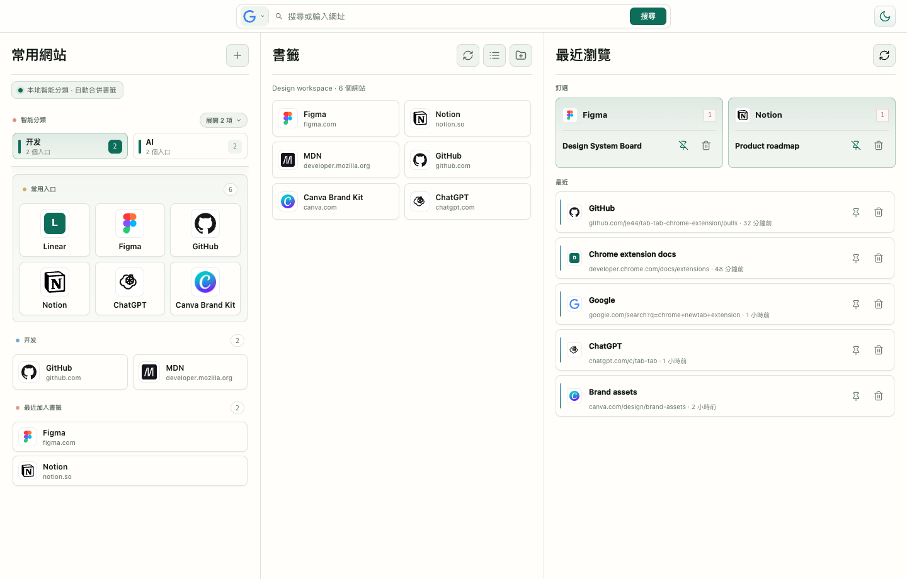
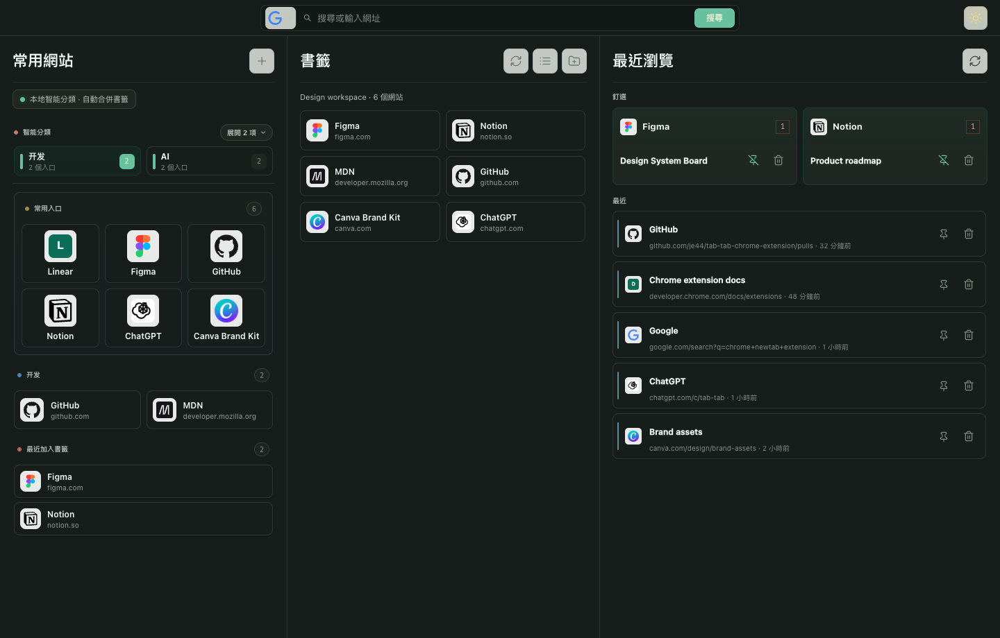

# tab-tab Chrome 扩展

`tab-tab` 是一个本地 Chrome 新标签页扩展，把常用入口、指定书签文件夹、最近浏览和快速搜索放在一屏，适合把浏览器当作日常工作台使用。

## 预览

| 日间模式 | 夜间模式 |
| --- | --- |
|  |  |

## 用户说明

`tab-tab` 更偏设计师和创作者的工作流：打开新标签页时，不再先面对空白搜索框，而是直接看到常用工具、项目书签和刚访问过的页面。

- **常用入口**：放固定工具和高频网站，适合设计、产品、研究、开发资料入口。
- **书签工作区**：选择一个 Chrome 书签文件夹，把项目资料变成可扫视的卡片墙。
- **最近浏览**：按网站整理近期页面，可置顶短期反复使用的页面。
- **主题切换**：支持日间和夜间模式，适合不同光线环境。
- **本地隐私**：不含远程脚本，不上传浏览数据。

### 下载

- 最新版本：[GitHub Releases](https://github.com/je44/tab-tab-chrome-extension/releases/latest)
- v1.0 页面：[v1.0 Release](https://github.com/je44/tab-tab-chrome-extension/releases/tag/v1.0)
- v1.0 安装包：[tab-tab-v1.0.0.zip](https://github.com/je44/tab-tab-chrome-extension/releases/download/v1.0/tab-tab-v1.0.0.zip)

### 安装

1. 下载并解压 `tab-tab-v1.0.0.zip`。
2. 打开 Chrome 的 `chrome://extensions/`。
3. 开启「开发者模式」。
4. 点击「加载已解压的扩展程序」，选择解压后的文件夹。
5. 新建标签页，确认页面已切换为 `tab-tab`。

### 权限

- `bookmarks`：读取书签文件夹和书签项。
- `history`：读取最近浏览记录。
- `favicon`：显示网站图标。
- `storage`：保存自定义入口、书签选择、置顶历史、主题和布局偏好。

## 技术说明

这是一个无构建步骤的 Chrome Manifest V3 扩展。`manifest.json` 通过 `chrome_url_overrides.newtab` 指向 `newtab.html`，页面直接加载 `newtab.css` 和 `newtab.js`，源码目录本身即可被 Chrome 加载。

### 代码结构

- `manifest.json`：扩展声明、版本号、权限、图标和新标签页入口。
- `newtab.html`：页面结构、三栏区域、搜索栏、弹层和卡片模板。
- `newtab.css`：主题、布局、响应式规则和卡片视觉。
- `newtab.js`：单页运行时，负责 Chrome API 读取、状态保存、渲染和交互。
- `icons/`：扩展图标和默认入口图标。
- `docs/`：图标来源、产品事实和 README 预览图。

### 架构方向

当前保持轻量单页结构，不引入框架或打包工具，方便直接加载、调试和发布。后续如果继续扩展，优先把 `newtab.js` 按 `portals`、`bookmarks`、`history`、`search`、`storage`、`i18n` 拆分；同时保持数据本地化，新增功能前再评估是否需要扩大权限。

### 打包发布

```sh
mkdir -p dist
zip -r -X dist/tab-tab-v1.0.0.zip manifest.json newtab.html newtab.css newtab.js icons
jq empty manifest.json
node --check newtab.js
unzip -t dist/tab-tab-v1.0.0.zip
```

发布包要求 `manifest.json` 位于 zip 根目录，并与 GitHub Release 版本保持一致。
